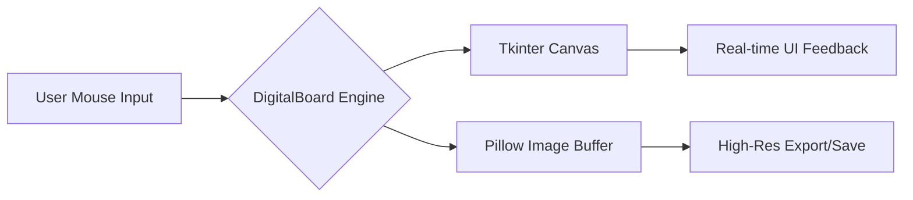

<div align="center">


[](https://www.python.org/)
[](https://python-pillow.org/)
[](https://docs.python.org/3/library/tkinter.html)
[](#)


</div>

## 🚀 Overview

The **Python Smart Digital Board — Pro Edition** is a world-class, high-performance digital sketching and teaching application. It bridges the gap between a standard GUI and professional drawing software by utilizing a dual-layer engine: **Tkinter** for real-time visual feedback and **Pillow (PIL)** for high-resolution, export-ready image processing.

> [!IMPORTANT]
> This Pro Edition features a **proper Flood Fill algorithm**, **smooth coordinate interpolation**, and a **multi-page system**, making it ideal for educators, designers, and developers.


## ✨ Key Features

### 🎨 Advanced Toolset

| Tool | Description | Icon |
| :--- | :--- | :---: |
| **Freehand** | Pen, Brush, Calligraphy, Highlighter | ✏️ |
| **Shapes** | Line, Rectangle, Circle, Triangle, Star, Diamond | shapes |
| **Effects** | Spray Paint, Laser Trail (Auto-fading) | 💫 |
| **Utility** | Flood Fill, Eraser, Text Injection | 🪣 |

### 🛠️ Technical Capabilities

* **Undo/Redo System:** Massive 200-step stack management using `collections.deque`.
* **Multi-Page System:** Navigate through multiple boards seamlessly without data loss.
* **Grid System:** Toggleable mathematical grids for precise drawing.
* **Smart Smoothing:** Uses distance-based interpolation for "buttery smooth" lines.
* **High-End Export:** Save your work in **PNG**, **JPG**, or export the session metadata as **JSON**.


## 🧠 Mental Model: How it Works

The application uses a **Dual-Buffer Architecture**. Every action you perform happens in two places simultaneously:



1. **Input:** Captures X, Y coordinates.
2. **Processing:** Normalizes coordinates (ensuring `x0 < x1` for PIL compatibility).
3. **Rendering:** Draws onto the Tkinter UI for the user and writes to the Pillow Buffer for data persistence.


## 🔍 Code Deep-Dive

### 1️⃣ Coordinate Normalization

PIL requires `x0 <= x1`. If a user draws from right-to-left, standard coordinates break.

```python
@staticmethod
def _normalize_coords(x0, y0, x1, y1):
    return (min(x0, x1), min(y0, y1), max(x0, x1), max(y0, y1))
```

* **Why?** This prevents crashes when drawing shapes in reverse directions.

### 2️⃣ The Flood Fill Logic

The application maps UI coordinates to the high-res buffer to perform a pixel-perfect fill.

```python
# Snapshot for Undo
old_image = self.image.copy()
# Perform Fill
ImageDraw.floodfill(self.image, (ix, iy), fill_rgb, thresh=30)
# Render back to UI
self._render_pil_to_canvas()
```

### 3️⃣ Laser Trail Effect

The Laser tool uses a `deque` to store temporary canvas IDs, deleting the oldest ones as new ones are added to create a "fading" effect.


## ⌨️ Keyboard Shortcuts

> [!TIP]
> Master these shortcuts to work 3x faster!

* **Ctrl + Z / Y**: Undo / Redo
* **Ctrl + S**: Save Board
* **Ctrl + G**: Toggle Grid
* **F11**: Fullscreen Mode
* **[ / ]**: Decrease / Increase Brush Size
* **P / B / E**: Quick Switch (Pen / Brush / Eraser)


## 🏗️ Installation & Usage

1. **Prerequisites:** Ensure you have Python 3.x installed.
2. **Install Dependencies:**

    ```bash
    pip install Pillow
    ```

3. **Run the App:**

    ```bash
    python digital_board.py
    ```


## 🌟 Real-Life Analogy

Imagine the **Tkinter Canvas** is a "Tracing Paper" you see in front of you, and the **Pillow Buffer** is the "Master Canvas" hidden underneath. When you draw, you are drawing on both. If you spill ink (Flood Fill) on the Master Canvas, we take a photo of it and slide it under your tracing paper so you can see the result.

## 🏆 Challenges for Learners

1. **Feature Add:** Try adding a "Stamp" tool that places a pre-defined image on the canvas.
2. **Logic Fix:** Modify the Undo stack to support restoring the specific state of the Fill tool.
3. **UI Polish:** Change the theme colors in `toggle_theme()` to match a "Nord" or "Solarized" color palette.


<div align="center">
    <p>Built with ❤️ for the Open Source Community</p>
    <b>⚡ Python Smart Digital Board — Pro Edition ⚡</b>
</div>
